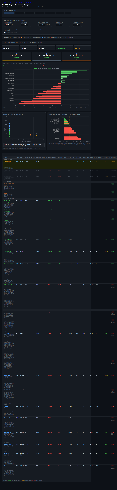

# Meal Optimiser

Decision-support tool for choosing the most cost-effective UK ready-meal strategy.
**Live: https://vincentdawn.github.io/meal-optimiser/**

The headline question: **at what hourly rate does each option become worthwhile?** It compares ~25 strategies — DIY supermarket cooking, frozen ready meals (Tesco, M&S, Iceland, Aldi, Lidl, Farmfoods), and Scotland-focused meal-prep delivery services (Diced, Riba, OuiPrep, Parsley Box, Wiltshire Farm Foods, etc.) — across cost, calories, protein and active prep time.



## Live site

It's a static site — open `index.html` in any browser, or serve the directory:

```bash
python -m http.server 8000
# open http://localhost:8000
```

No build step. Vanilla HTML/JS plus Chart.js from a CDN.

## What's where

```
index.html            Landing page → links to the dashboard and per-supplier filters
meal-analysis.html    Main interactive dashboard
meal-data.js          Hand-curated option list — defaults, baseline flags, notes
*-filter.html         Per-supplier exclusion tools (Tesco, M&S, Iceland, Parsley Box)
data/                 Scraped product catalogues, refreshed weekly
tests/                Playwright tests
.github/workflows/    CI — runs the test suite on push and PR
```

## How it works

1. **Scrape** (offline, weekly) — a separate private repo runs the actual scrapers on a residential connection. It commits the resulting `*_all_products.json` files into this repo's `data/` folder.
2. **Aggregate** — at boot, `meal-analysis.html` fetches each scraped JSON, applies the user's exclusions (saved in `localStorage` from the filter pages), and computes the average price/calories/protein on the fly.
3. **Personalise** — the user sets their hourly net rate, meals per week, in-store trip time and online order time. They can also override any of those per-store, mark services as unavailable, or set per-service delivery fees and minimum-order amounts.
4. **Rank** — the dashboard shows a top-3, a surplus chart vs the DIY Farmfoods baseline, a cost/time scatter, and a full comparison table. All recompute live as inputs change.

Everything lives in the user's browser. Settings persist per device in `localStorage`. Nothing is sent anywhere.

## Tests

Playwright drives a real Chromium through the analysis page and the four filter pages. Calculation tests run inside the browser via `page.evaluate()` so they exercise the same code the live UI uses.

```bash
npm install                         # one-time
npx playwright install chromium     # one-time, downloads ~110 MB
npm test                            # 44 tests, ~5 sec headless
npm run test:headed                 # watch the browser do its thing
npm run test:ui                     # Playwright's UI mode for debugging
```

The Playwright config auto-boots `python -m http.server 8765` before the tests and reuses any server already running on that port. CI mode (`process.env.CI`) switches the reporter to GitHub annotations and bumps retries to 1.

## License

Personal project, no warranty. Use at your own risk; double-check anything before relying on it for actual meal planning. Product data is observational and may lag the supplier's site.
